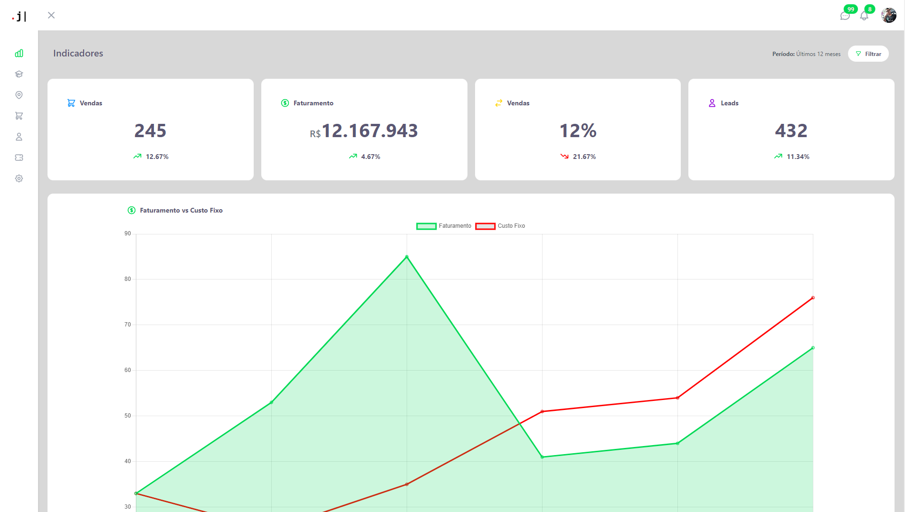

# Painel de Vendas Mensais

Esse é um projeto feito durante um desafio, ele foi feito em cerca de 7 horas, usando tecnologias como:
TypeScript, Tailwind CSS, Headless UI, HeroIcons, React, Chart JS.

## Como utilizar o repositório

Você pode utilizar o meu [deploy](https://j-pster.github.io/painel-desafio-lighthouse/) no GitHub, ou clonar o projeto para rodar localmente, o projeto ainda não está pronto e será melhorado, então, o Preview acima pode estar desatualizado.

### `npm install`

Rode esse comando para instalar as dependências necessárias para iniciar o projeto.

### `npm start`

Rode esse comando para começar a ver o projeto.
Abra seu [http://localhost:3000](http://localhost:3000) para ver funcionando.
